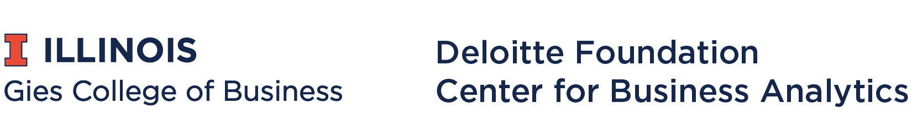

  

# Data Carpentry for Business:  SQL

The '[SQL Lessons for Business](https://github.com/data-lessons/SQL-business)' workshop series is developed and maintained by [Prof. Robert J. Brunner](https://business.illinois.edu/profile/robert-brunner/) and [Hao Xi](https://github.com/TacNayn). It is funded by Deloitte Foundation Center for Business Analytics at Gies College of Business, University of Illinois at Urbana, Champaign.  

## Background

SQL Lessons for Business is a software skills training programme aimed at business students. It helps business students learn about relational database and develop basic SQL querying skills. It builds on the work of [Data Carpentry](http://www.datacarpentry.org). It used [SQL for Ecology](https://github.com/datacarpentry/sql-ecology-lesson) as basis. 

## Code of Conduct

All participants should agree to abide by the [Software Carpentry Code of Conduct](http://software-carpentry.org/conduct/).

## Contributors

- Robert Brunner (PI)

- [Neal Davis](https://github.com/davis68)
- [Aria Novianto](https://github.com/ariapn)
- [Elizabeth Wickes](https://github.com/elliewix)
- [Hao Xi](https://github.com/TacNayn) (initial author)

Maintained by [Neal Davis](https://www.github.com/davis68).

## Citation

Please cite as:

Data Carpentry. SQL Lesson for Business. April 2018. https://github.com/data-lessons/SQL-business.
